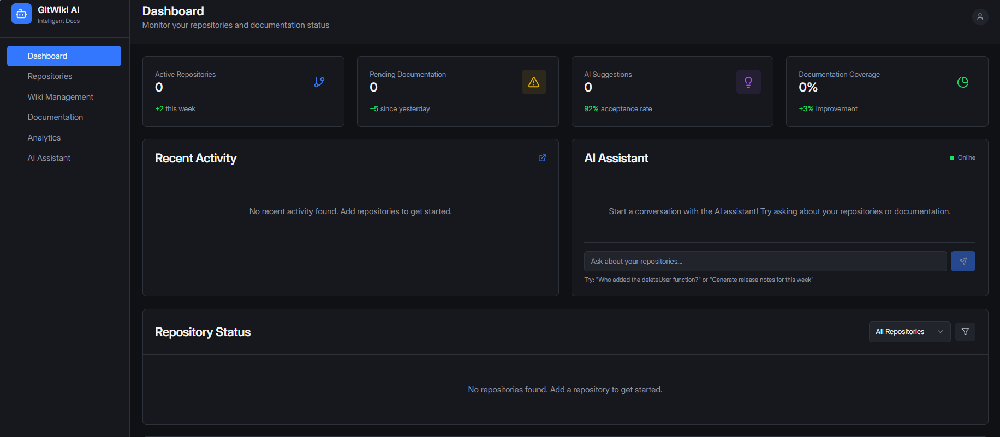

# 🤖 AI Insight

<p align="center">
  
</p>

<p align="center">
  <a href="#/JavaScript"></a>
  <a href="#-TypeScript"></a>
  <a href="#-license"></a>
  <a href="https://github.com/mrvoidx/mansblog/commits/main"></a>
  
</p>

AI-powered assistant that bridges the gap between your **Git commits** and **Wiki documentation**.  
This project keeps your docs always up to date, provides intelligent insights, and helps your team stay aligned.  

---

## 🚀 Features

1. **Auto Documentation Updates**  
   - AI scans new commits and updates or drafts wiki entries.  
   - Example: *“Module X added a new function `calculateTax()`. Wiki draft: ‘Calculates tax based on user input.’”*  

2. **Detect Missing Information**  
   - Highlights commits without corresponding wiki updates.  
   - Example: *“There are 5 commits in `PaymentService` with no wiki documentation.”*  

3. **Generate Summaries & Release Notes**  
   - Summarizes code changes + wiki updates for a sprint or release.  
   - Example: *“This week: Added payment API, fixed login bug, updated wiki for user authentication.”*  

4. **Answer Developer Questions**  
   - AI acts like a knowledge assistant using both **code + docs**.  
   - Example Q&A:  
     - Q: *“Who added the `deleteUser()` function?”*  
     - A: *“Commit `abc123` by Alice on July 20, 2025. Wiki updated to reflect this change.”*  

5. **Suggest Process Improvements**  
   - Detects patterns such as undocumented changes or inconsistent wiki updates.  
   - Example: *“Many commits in module Y are missing wiki explanations. Recommend automatic reminders or templates.”*  

---

## 📸 Screenshot

Here’s a quick preview of the project’s dashboard:  


---

## 🛠️ Installation

```bash
# Clone the repository
git clone https://github.com/mrvoidx/ai-insight.git

# Navigate into the project folder
cd ai-insight

# Install dependencies
- npm install
- npm run build
- or just click on `run-windows` and it will do everything for you.

# important
- make sure you have a gemini api key and put it in the `run-windows` or `.env` for mannual setups.

```

---

## ⚡ Usage

1. Make a commit in your project.  
2. Run the assistant to analyze changes
3. The AI will:  
   - Update wiki entries.  
   - Suggest documentation changes.  
   - Generate release notes.  
   - Answer developer questions.  

---

## 📂 Project Structure

```
AI-Insight/
│── src/                 # Source code
│── public/              # Static assets
│── components/          # UI components
│── assets/              # Images, logos, screenshots
│── .env                 # Environment variables
│── package.json         # Dependencies & scripts
│── vite.config.ts       # Vite configuration
│── tailwind.config.ts   # TailwindCSS config
│── tsconfig.json        # TypeScript config
│── run-windows          # Start script
```

---

## 🤝 Contributing

Contributions are welcome! 🚀  

1. Fork the repository  
2. Create a feature branch (`git checkout -b feature/my-feature`)  
3. Commit your changes (`git commit -m 'Add my feature'`)  
4. Push to the branch (`git push origin feature/my-feature`)  
5. Open a Pull Request  

---

## 📜 License

MIT License © 2025 MrVoidx.

Permission is hereby granted, free of charge, to any person obtaining a copy  
of this software and associated documentation files (the “Software”), to deal  
in the Software without restriction, including without limitation the rights  
to use, copy, modify, merge, publish, distribute, sublicense, and/or sell  
copies of the Software, and to permit persons to whom the Software is  
furnished to do so, subject to the following conditions:  

The above copyright notice and this permission notice shall be included in  
all copies or substantial portions of the Software.  

THE SOFTWARE IS PROVIDED “AS IS”, WITHOUT WARRANTY OF ANY KIND, EXPRESS OR  
IMPLIED, INCLUDING BUT NOT LIMITED TO THE WARRANTIES OF MERCHANTABILITY,  
FITNESS FOR A PARTICULAR PURPOSE AND NONINFRINGEMENT. IN NO EVENT SHALL THE  
AUTHORS OR COPYRIGHT HOLDERS BE LIABLE FOR ANY CLAIM, DAMAGES OR OTHER  
LIABILITY, WHETHER IN AN ACTION OF CONTRACT, TORT OR OTHERWISE, ARISING  
FROM, OUT OF OR IN CONNECTION WITH THE SOFTWARE OR THE USE OR OTHER DEALINGS  
IN THE SOFTWARE..  
